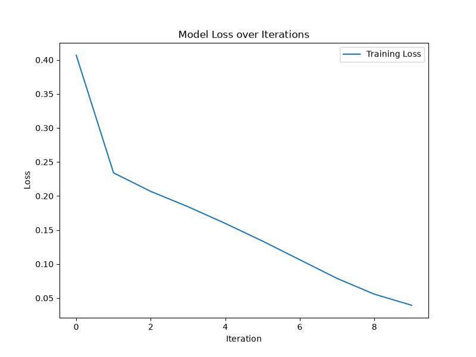
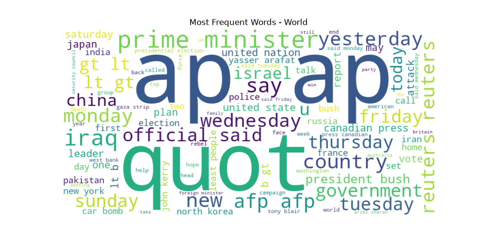
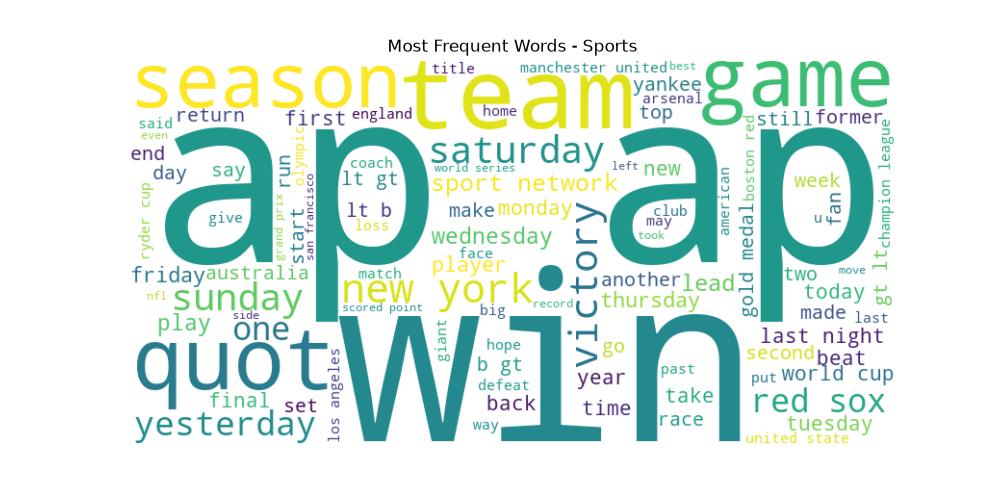
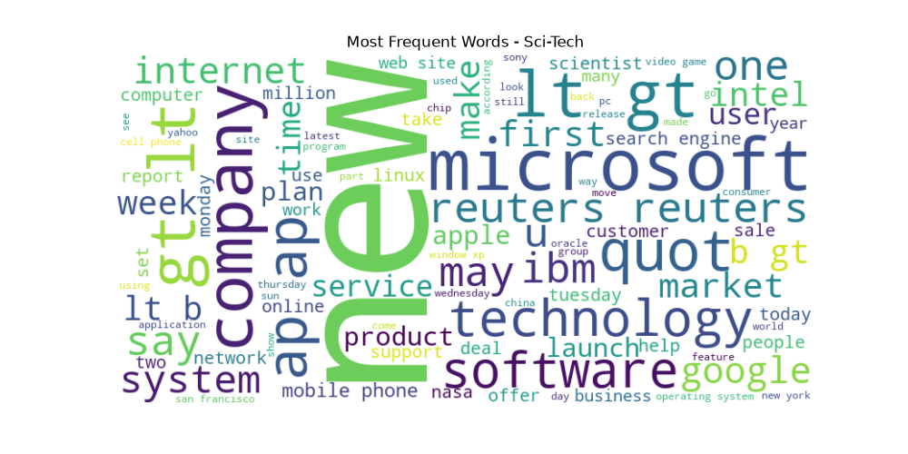

# News Category Classification

This project implements a complete end-to-end Machine Learning pipeline to classify news articles into four distinct categories: **World**, **Sports**, **Business**, and **Sci-Tech**. It utilizes the AG News dataset.

## Table of Contents
- [Overview](#overview)
- [Pipeline Architecture](#pipeline-architecture)
- [Requirements & Installation](#requirements--installation)
- [Usage](#usage)
- [Visualizations](#visualizations)

---

## Overview

The goal of this project is to accurately categorize news titles and descriptions using Natural Language Processing (NLP). The text undergoes standard NLP preprocessing (tokenization, stopword removal, and lemmatization) before being transformed into numerical vectors via TF-IDF. A Multilayer Perceptron (MLP) Classifier serves as the core predictive model.

## Pipeline Architecture

The codebase is split into modular components for maintainability and scalability:

1. **`data_preprocess.py`**: Handles text cleaning and normalization using NLTK.
2. **`train.py`**: Constructs and trains the Scikit-Learn `MLPClassifier` feedforward neural network.
3. **`plots.py`**: Generates insightful visualizations, including word clouds for each category and the model's loss curve during training.
4. **`main.py`**: The central orchestrator that parses command-line arguments, links the preprocessing, TF-IDF vectorization, training, and plotting steps together.
5. **`inference.py`**: Loads the saved TF-IDF vectorizer and the trained model to make predictions on test data samples.

---

## Requirements & Installation

It is recommended to run this project inside an isolated Conda environment.

1. **Activate the environment**:
   ```bash
   conda activate category_classification
   ```
2. **Install dependencies**:
   ```bash
   pip install pandas scikit-learn nltk matplotlib wordcloud joblib
   ```

---

## Usage

### 1. Training the Model
To start the full pipeline (preprocessing -> vectorization -> training -> plotting), execute:
```bash
python main.py
```
You can also tweak hyperparameters using arguments:
```bash
python main.py --epochs 15 --batch_size 128 --max_words 10000
```
This will save the trained model to `models/ag_news_model.pkl` and the vectorizer to `models/tfidf_vectorizer.pkl`.

### 2. Running Inference
To see the model in action on unseen data, run the inference script. It randomly samples 5 news articles from the test set and prints the model's predictions side-by-side with the original text.
```bash
python inference.py
```

---

## Visualizations

### Model Training Loss
The MLP Classifier optimizes over several iterations. The following plot shows how the loss decreases across training epochs.



### Category Word Clouds
To understand the defining characteristics of each news category, we generated word clouds highlighting the most frequent words found in the preprocessed text.

#### World News


#### Sports News


#### Business News


#### Sci-Tech News
